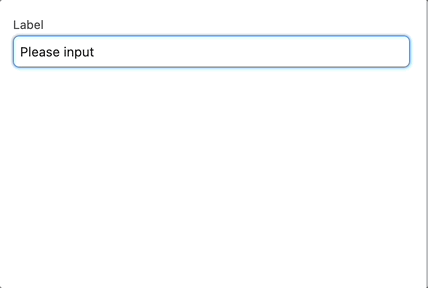
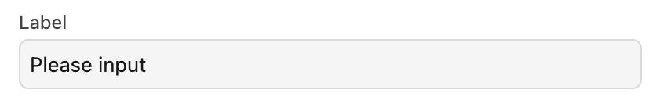
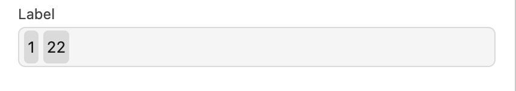
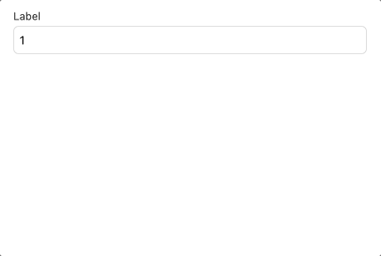
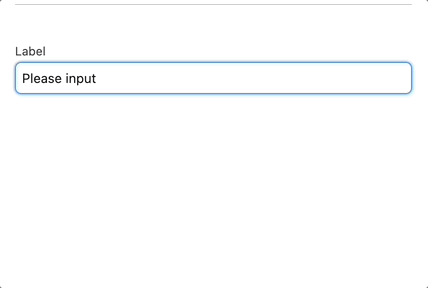
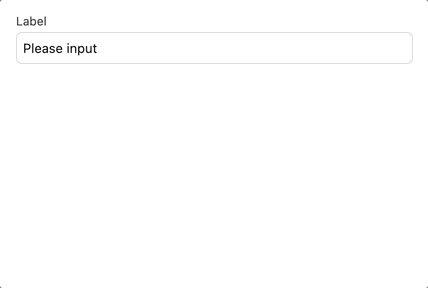
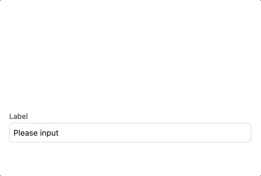
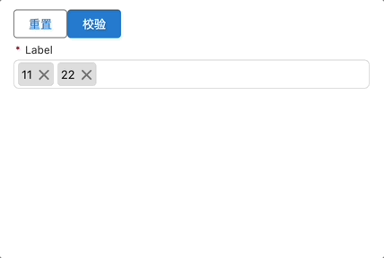

# Salesforce-lwc-fancy-select

# 说明

    针对于 远程搜索下拉多选 的场景。
    Trigger、下拉项 和 多选的 pills 没有抽取成单个组件，如果有需要可以自行调整（时间有限）

覆盖了常见的使用场景:

- 单选
- 多选
- 默认值
- 关键词过滤
- 远程搜索
- 只读
- 必填
- 校验
- 重置
- 事件：change/blur/focus/clear

额外的功能:

- 远程搜索防抖
- 自动修复默认值的显示（提供了默认值没有提供 options 的情况下，会在匹配到相应 option 后修正选中显示的 label）

# API

| 属性          | 类型                                                                                | 默认值        | 说明                                                                                                                                                                         |
| ------------- | ----------------------------------------------------------------------------------- | ------------- | ---------------------------------------------------------------------------------------------------------------------------------------------------------------------------- |
| required      | boolean                                                                             | false         | 必填                                                                                                                                                                         |
| disabled      | boolean                                                                             | false         | 禁用                                                                                                                                                                         |
| label         | string                                                                              | Label         | 显示标签                                                                                                                                                                     |
| options       | array                                                                               | []            | 下拉选项列表                                                                                                                                                                 |
| multiple      | boolean                                                                             | false         | 是否开启多选                                                                                                                                                                 |
| defaultValue  | array \| string                                                                     | []            | 默认值                                                                                                                                                                       |
| placeholder   | string                                                                              | Please input  | 占位符                                                                                                                                                                       |
| placement     | string                                                                              | bottom        | 下拉项显示的位置,可选 `bottom` 和 `top`                                                                                                                                      |
| pillsPosition | string                                                                              | bottom        | 💊 的位置，可选值 `inline` 和 `bottom`                                                                                                                                       |
| errMessage    | string                                                                              | Please input! | message when validate failed                                                                                                                                                 |
| showSearch    | boolean                                                                             | false         | 是否允许输入                                                                                                                                                                 |
| filterOption  | `(inputVal: string, option: {label:string,value: string, id: string }) => boolean`  | `() => true`  | 过滤选项，第一个参数为当前输入的值，第二个值为选项数据                                                                                                                       |
| fetch         | `(inputVal: string, startLoading: () => void, stopLoading: () => void ) => Promise` | -             | 远程搜索选项，接受一个函数，函数第一个参数为当前输入的值，第二个参数为一个函数，调用函数可以开启下拉列表的 loading，第三个参数为一个函数，调用函数可以停止下拉列表的 loading |
| debounce      | number                                                                              | 300(ms)       | 防抖时长                                                                                                                                                                     |

## Methods

### validate

对于当前表单项的必填校验, 返回值为校验结果（true/false）

```typescript
const res = this.template.querySelector('xxx').validate()
```

### reset

重置当前表单项, 重置值为 `defaultValue`

```typescript
this.template.querySelector('xxx').reset()
```

# 一些场景

## 1. 基础单选(Basic Select)



## 2. 单选/多选禁用(Disabled)




## 3. 单选、默认值、关键词过滤（Select with Default Value and Keyword Filter）



## 4. 基础多选(Basic Multi Select)



## 5. 多选、关键词过滤（Multi Select with Keyword Filter）



## 6. 多选、下拉项显示位置、选中项药丸显示位置（Multi Select with Placement and Pills Position）



## 7. 多选、必填、默认值、关键词过滤、远程搜索、校验、重置（Multi Select with Required, Default Value, Keyword Filter, Remote Search, Validation, Reset）


